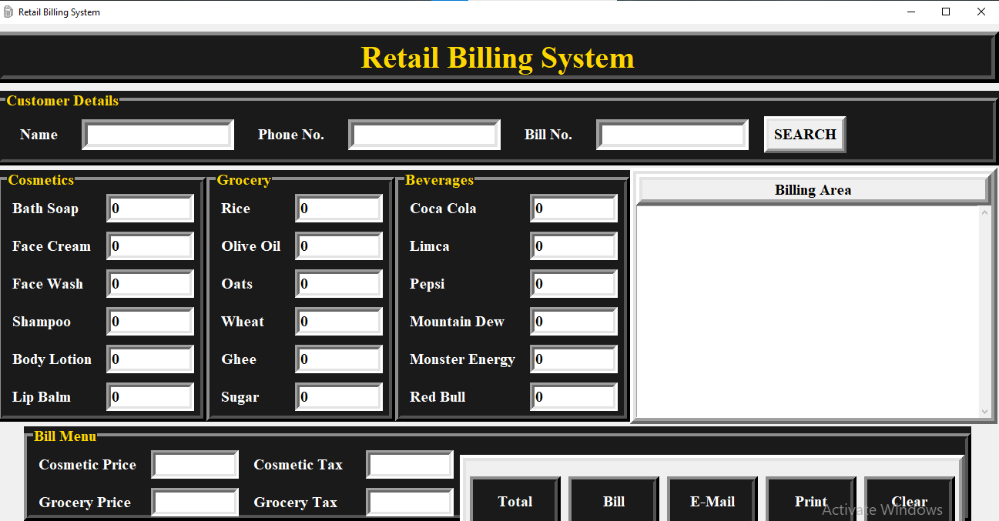

# 🧾 RETAIL BILLING SYSTEM - Python + Tkinter

A complete **desktop-based billing software** built using **Python and Tkinter**, ideal for small to mid-scale retail shops. The application provides a clean GUI for generating itemized bills, calculating taxes, and printing or emailing the final invoice. This project demonstrates how Python can be used to build real-world applications using built-in GUI tools.

---

## 📌 KEY FEATURES

✅ **GUI Application** using Tkinter  
✅ **Category-wise billing** (Cosmetics, Grocery, Beverages)  
✅ **Automatic price + tax (GST) calculation**  
✅ **Customer info input** (Name, Phone Number)  
✅ **Formatted receipt generation**  
✅ **Print and Save bill** (.txt format)  
✅ **Email invoice** directly via SMTP (Gmail)  
✅ **Search previous bills** by bill number  
✅ **Easy Reset/Clear** function  
✅ Comes with **icon** and **screenshot** for branding and UI preview  
✅ Includes `setup.py` for easy packaging and deployment

---

## 🧱 TECHNOLOGIES USED

| Component      | Description                    |
|----------------|--------------------------------|
| Python 3.x     | Core programming language      |
| Tkinter        | GUI creation                   |
| `smtplib`      | Email sending (SMTP)           |
| `os`, `tempfile`, `random` | File & temp management |
| `.ico` file    | Custom window icon             |

---

## 📁 PROJECT STRUCTURE

```

Retail-Billing-System/
│
├── Billing.py           # Main application script
├── setup.py             # Setup configuration for packaging
├── icon.ico             # Custom icon for GUI window
├── billing.png            # GUI Screenshot (for README)
├── bills/               # Folder where saved bills (.txt) are stored
└── README.md            # Project documentation

````

---

## 🖼 SCREENSHOT

<p align="center">
  
</p>

---

## ⚙️ HOW TO RUN

### OPTION 1: Run Directly (Best for Development)

1. Install Python 3.x from [python.org](https://www.python.org/)

2. CLONE THE REPOSITORY:
```bash
git clone https://github.com/your-username/retail-billing-system.git
cd retail-billing-system
````

3. RUN THE APP:

```bash
python Billing.py
```

---

### OPTION 2: Install via `setup.py`

You can install the app using the Python setup tools:

```bash
python setup.py install
```

You can then run the app from the installed location.

---

## 📦 REQUIREMENTS

No external libraries are strictly required, but for completeness:

```bash
pip install -r requirements.txt
```

(If needed, create `requirements.txt` with `pip freeze > requirements.txt`)

---

## 📧 E-MAIL SENDING SETUP

The app uses `smtplib` to send emails. To use Gmail:

1. Enable **"Less Secure Apps"** or **App Passwords** in your Gmail account.
2. Input sender Gmail, password, and recipient in the popup window.
3. The bill is auto-attached in the body text.

---

## 🔐 PRIVACY & SECURITY

* Passwords entered in the email popup are not stored.
* Bills are saved locally in the `bills/` folder.
* No internet connection is required unless using the email feature.

---

## 🚀 USE CASE

* Local shops or supermarket kiosks needing a simple POS system
* Python GUI mini-project for students
* Base model for more advanced POS or inventory systems

---

## 🧑‍💻 AUTHOR

**Vinamra Gupta**
📧 (gvinamra73@gmail.com)
🌐 (www.linkedin.com/in/vinamra-gupta-0aa4b4375)

---

## 📄 LICENSE

This project is open source and available under the [MIT License](LICENSE).


